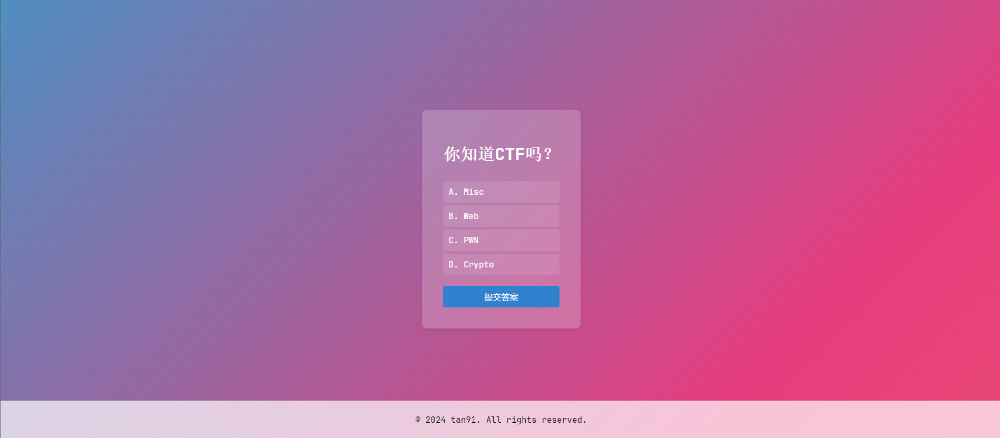

---

    &emsp;
    &emsp;
    &emsp;
    &emsp;
    &emsp;
    

---

# 理论题答题界面

这是一个简单的单项选择题页面，使用HTML、CSS和PHP构建。用户可以在页面上选择答案，并提交表单来验证答案是否正确。

## 功能

- 显示单项选择题目。
- 用户可以选择一个答案。
- 提交答案后，页面会显示答案是否正确。
- 正确答案不会直接显示给用户。

## 如何使用

1. 克隆仓库到本地。
2. 确保你的服务器环境支持PHP（如使用XAMPP、WAMP、MAMP或其他PHP服务器）。
3. 将项目文件放置在你的服务器目录中（例如`htdocs`、`www`或其他服务器根目录）。
4. 在浏览器中访问项目，例如`http://localhost/your_project_folder`。

## 开发环境

项目使用以下技术开发：

- HTML5
- CSS3
- PHP 7.3 或更高版本

## 贡献

如果你有任何建议或改进，请提交Pull Request或开Issue。

## 版权和许可

版权所有 © 2024 tan91。保留所有权利。

本项目根据MIT许可证发布 - 有关详细信息，请查看[LICENSE](LICENSE)文件。

## 使用截图

